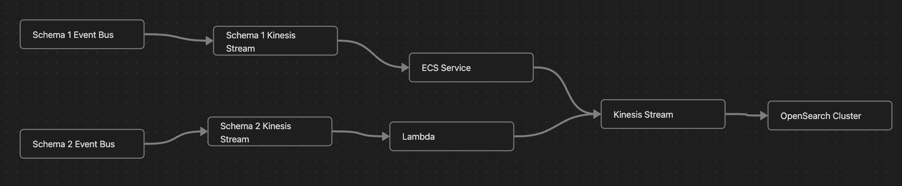
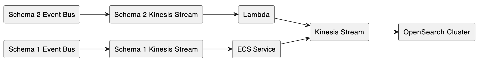

# canvas2plantuml

A toy tool to convert an Obsidian `.canvas` to a basic `.plantuml` diagram.

## usage

```bash
canvas2plantuml $CANVAS_FILE > output.plantuml
```

## example


| input | output |
|----|----|
| |  |

Generates output like:

```plantuml
left to right direction
rectangle "Kinesis Stream" as 19905b20469592aa
rectangle "Lambda" as c724f8ccd03b7ada
rectangle "Schema 2 Kinesis Stream" as 5f18bc50e4a5f3d3
rectangle "ECS Service" as 354888ce82ab23ee
rectangle "Schema 2 Event Bus" as a327ab852e34bae2
rectangle "Schema 1 Event Bus" as 541b9262fc2914e5
rectangle "OpenSearch Cluster" as 77f79cfde63759fd
rectangle "Schema 1 Kinesis Stream" as 91ffbf200d31cd91
91ffbf200d31cd91 --> 354888ce82ab23ee
a327ab852e34bae2 --> 5f18bc50e4a5f3d3
354888ce82ab23ee --> 19905b20469592aa
19905b20469592aa --> 77f79cfde63759fd
c724f8ccd03b7ada --> 19905b20469592aa
5f18bc50e4a5f3d3 --> c724f8ccd03b7ada
541b9262fc2914e5 --> 91ffbf200d31cd91
```
